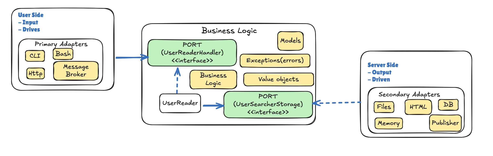

# hexagonal architecture (ports and adapters)

## Objective

- Allows isolating the core business logic from technologies (scripts, databases, protocols) and avoiding dependency on them.
- The application is always driven by the user.
- Enables automated testing without dependencies on specific technologies.
- Reinforces and aligns with Clean Architecture.

### Principles

Hexagonal architecture is based on three fundamental principles:

- User-Side, Business Logic, and Server-Side.
- User-Side and Server-Side dependencies drive business logic.
- Ports and Adapters.



### User-Side

- This is the side through which the user or external programs will interact with the application.

### Business Logic

- This is the part that we want to isolate from both left and right sides. It contains all the code that concerns and implements business logic.

### Server-Side

- This is where we’ll find what your application needs, what it drives to work. It contains essential infrastructure details such as the code that interacts with your database, makes calls to the file system, or code that handles HTTP calls to other applications on which you depend for example.

```txt
|------------|              |----------------|              |-------------|
| User side  | ===[port]==> | Business logic | <===[port]== | server side |
|------------|              |----------------|              |-------------|

```

### Ports and Adapters

- Adapters: represent the external code that acts as the glue between the port and the rest of the user-side or server-side code.

- Ports: They are interfaces defined by the business logic that establish contracts (rules) enabling interactions with the external world.

```txt
├───cmd                         👉🏼 (execute commands)
│   ├───bootstrap               👉🏼 (bootstrap package that builds the program with its full set of components)
│   └───http                    👉🏼 (the directory name for each application should match the name of the executable)
├───internal                    👉🏼 (private packages)
│   ├───app                     👉🏼 (core business)
│   │   ├───(module)            👉🏼 (represents a boundary)
│   │   │   ├───business        👉🏼 (business logic layer)
│   │   │   │   ├───domain      👉🏼 (data transfer objects, business objects, errors, entities, value objects)
│   │   │   │   ├───ports       👉🏼 (business contracts)
│   │   │   │   └───services    👉🏼 (business logic)
│   │   │   └───infrastructure  👉🏼 (layer infrastructure)
│   │   │       ├───driven      👉🏼 (output adapters)
│   │   │       └───drives      👉🏼 (input adapters)
├───pkg                         👉🏼 (explicitly communicate that the code in that directory is safe for use by others -> global code or libraries)
```

#### References

- [The Pattern: Ports and Adapters (‘’Object Structural’’) ](https://alistair.cockburn.us/hexagonal-architecture/)
- [Standard Go Project Layout](https://github.com/golang-standards/project-layout)
- [Hexagonal Architecture: three principles and an implementation example](https://blog.octo.com/hexagonal-architecture-three-principles-and-an-implementation-example)
